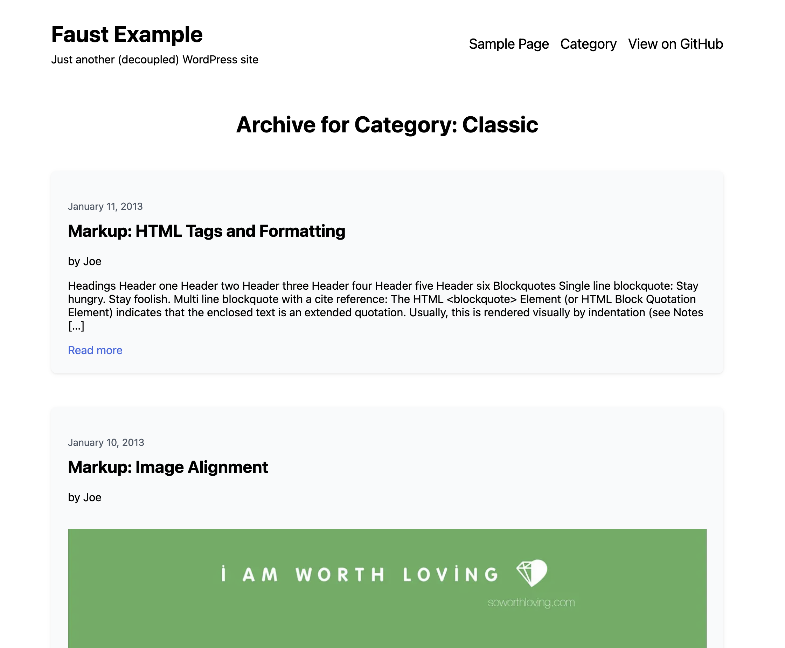
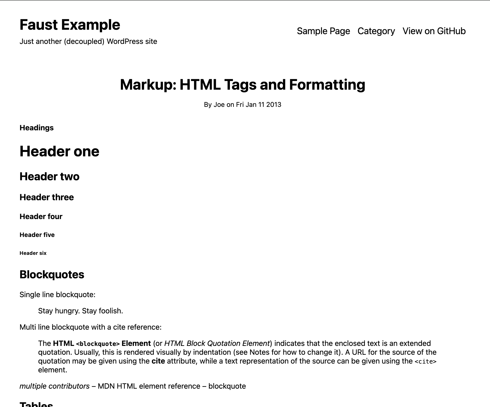

#  Faust.js Project Evolution

This project began as a starter kit from [WP Engine's Headless Platform](https://wpengine.com/headless-wordpress/) and has since evolved with significant enhancements.

## Getting Started 🚀

To get started on WP Engine's Platform please follow the docs here [https://developers.wpengine.com/docs/atlas/getting-started/create-app/](https://developers.wpengine.com/docs/atlas/getting-started/create-app/)

## Project Structure

```bash
├── components/
├── fragments/
├── pages/
├── queries/
├── styles/
├── wp-templates/
│   ├── archive.js          # For your category/archive templates
│   ├── front-page.js       # Front page
│   ├── index.js            # Mapping for available templates
│   ├── page.js             # Single page
│   └── single.js           # Single post or singular
├── DEVELOPMENT.md
├── faust.config.js
├── next.config.js
├── package.json
├── possibleTypes.json
└── README.md
└── screenshots
```

## Available Commands

| Command       | Script                        | Description                                |
| ------------- | ----------------------------- | ------------------------------------------ |
| `dev`         | `next dev`                    | Start the development server (modified)    |
| `build`       | `faust build`                 | Build the project for production           |
| `generate`    | `faust generatePossibleTypes` | Generate GraphQL possible types            |
| `start`       | `faust start`                 | Start the production server                |
| `format`      | `prettier . --write`          | Format code with Prettier                  |
| `test:format` | `prettier . --check`          | Check code formatting                      |

## Screenshots

<details>
    <summary>View Screenshots</summary>







</details>

## Our Community 🩵

At WP Engine, we have a strong community built around headless WordPress to support you with your journey.

- [Discord Headless Community Channel](https://faustjs.org/discord)
- [Fortnightly Headless Community Call](https://discord.gg/headless-wordpress-836253505944813629?event=1371472220592930857)
- [WP Engine`s Headless Platform developer community](https://wpengine.com/builders/headless)
- [WP Engine's Builders YouTube Channel](https://www.youtube.com/@WPEngineBuilders)
- [WP Engine's Headless Platform](https://wpengine.com/headless-wordpress/)
- [WP Engines Headless Platform Docs](https://developers.wpengine.com/docs/atlas/overview/)

## Plugin Ecosystem 🪄

- [Faust.js](https://faustjs.org)
- [WPGraphQL](https://www.wpgraphql.com)
- [WPGraphQL Content Blocks](https://github.com/wpengine/wp-graphql-content-blocks)
- [WPGraphQL IDE](https://github.com/wp-graphql/wpgraphql-ide)
- [HWP Toolkit](https://github.com/wpengine/hwptoolkit)

## Documentation 🔎

> [!NOTE]
> We are continuously adding new docs for [Faustjs.org](https://faustjs.org/docs)

- [Faust.js Documentation](https://faustjs.org/docs/)
- [Headless Platform Documentation](https://wpengine.com/headless-wordpress/)
- [WPGraphQL Documentation](https://www.wpgraphql.com/docs/introduction)


## Contributions

## Contributor License Agreement

All external contributors to WP Engine products must have a signed Contributor License Agreement (CLA) in place before the contribution may be accepted into any WP Engine codebase.

1. [Submit your name and email](https://wpeng.in/cla/)
2. 📝 Sign the CLA emailed to you
3. 📥 Receive copy of signed CLA

❤️ Thank you for helping us fulfill our legal obligations in order to continue empowering builders through headless WordPress.

### Development Server Issue

The original scaffolding uses the `faust dev` command to start the development server. However, this command was not working correctly in this environment.

To fix this, the `dev` script in `package.json` was modified to use the `next dev` command directly.

**Original script:**
```json
"dev": "faust dev"
```

**Modified script:**
```json
"dev": "next dev"
```

`faust dev` is a wrapper around `next dev` provided by the Faust.js CLI. In this case, it was necessary to bypass the wrapper and use the Next.js command directly to start the development server.

### TypeScript Migration

To improve code quality and maintainability, the project was migrated from JavaScript to TypeScript. The following steps were performed:

1.  **Installed TypeScript Dependencies:** `typescript`, `@types/react`, and `@types/node` were installed as development dependencies.
2.  **Created `tsconfig.json`:** A `tsconfig.json` file was created in the project root with a standard Next.js TypeScript configuration.
3.  **Renamed Files:** All `.js` files in the `pages`, `components`, `fragments`, `queries`, and `wp-templates` directories were renamed to `.tsx` (for files with JSX) or `.ts` (for files without JSX).
4.  **Fixed Type Errors:** Type errors introduced by the migration were addressed to ensure the project compiles correctly with TypeScript.

### Tailwind CSS Migration

To modernize the styling and remove all other CSS implementations, the project was migrated to Tailwind CSS. The following steps were performed:

1.  **Installed Tailwind CSS Dependencies:** `tailwindcss`, `postcss`, and `autoprefixer` were installed as development dependencies.
2.  **Created Tailwind CSS Configuration Files:** `tailwind.config.js` and `postcss.config.js` were created in the project root.
3.  **Configured `globals.css`:** The `styles/globals.css` file was updated to include the Tailwind CSS directives (`@tailwind base; @tailwind components; @tailwind utilities;`) and all other existing CSS rules were removed.
4.  **Removed CSS Modules:** All `.module.css` files from the `styles` directory were deleted.
5.  **Refactored Components:** All components and pages that previously used CSS modules were refactored to use Tailwind CSS utility classes instead. This involved removing `import` statements for CSS modules and replacing the old class names with appropriate Tailwind classes.